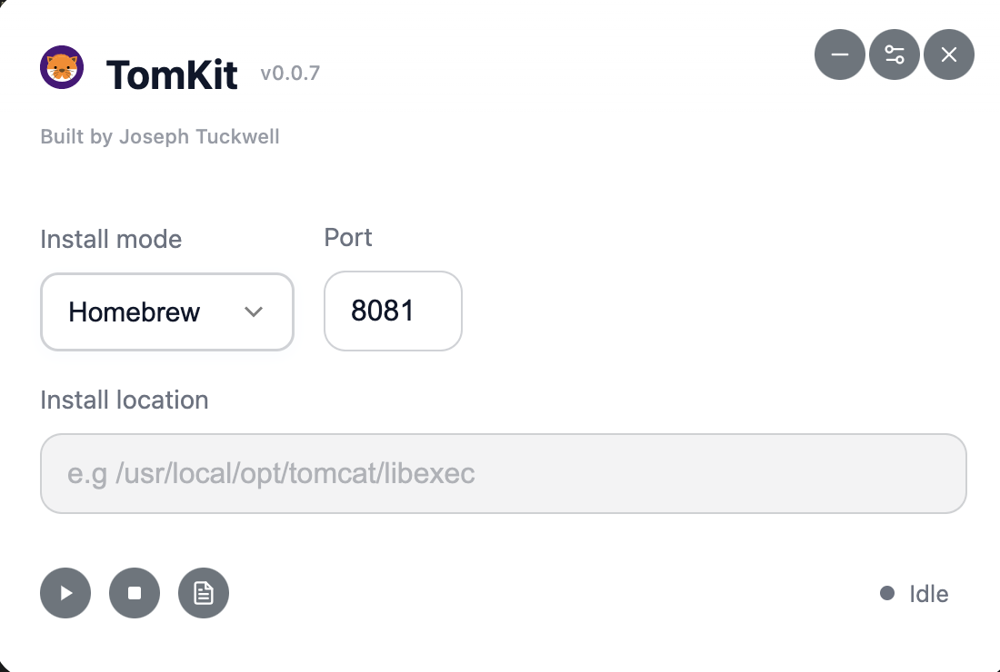

# TomKit



TomKit is a simple Electron-based tool for managing Apache Tomcat installations on your system. It allows you to start and stop Tomcat either as a Homebrew service or via a manual install path.

## Features

- Start/stop Tomcat as a Homebrew service or manual install

## Installation

1. **Clone the repository:**
   ```sh
   git clone https://github.com/josephtuckwell/TomKit.git
   cd TomKit
   ```

2. **Install dependencies:**
   ```sh
   npm install
   ```

## Run

Start the app with:
```sh
npm run start
```

## Packaging

```
npm run build:mac    # Mac OS
npm run build:win    # Windows
npm run build:linux  # Linux
```

## Usage

1. Select the install type (Homebrew or Manual).
2. If using Manual, enter the Tomcat install path.
3. Click **Start** to start Tomcat, or **Stop** to stop it.

---

**Note:**  
- For Homebrew mode, Tomcat must be installed via Homebrew and available as a service.
- For Manual mode, ensure the `startup.sh` and `shutdown.sh` scripts are present and executable in the bin folder of specified directory.